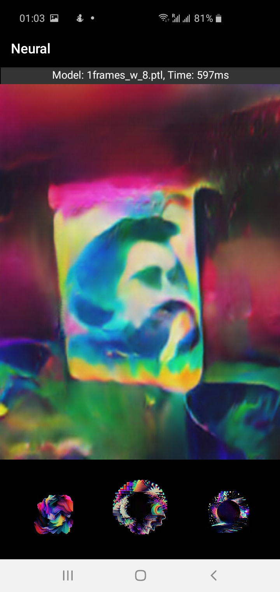

# Neural

This is Android camera application that enables users to apply captivating 'acid' visual effects
to their camera feed, using real-time style transfer effects.

Additionally, users have the option to select a video from their gallery and apply the desired style to it.

 

The application supports multiple metric hacking models, including DISTS, LPIPS, and HaarPSI, available in different sizes
to suit a range of devices and performance capabilities.
Currently all the models are CPU-only.

The application uses parallel processing of multiple frames to improve the performance,
ensuring that users can enjoy smooth, real-time style transfer effects.
Also it features an intuitive interface, allowing users to quickly and easily navigate and use all the features.

## LICENSE

THIS SOFTWARE IS PROVIDED BY THE COPYRIGHT HOLDERS AND CONTRIBUTORS "AS IS"
AND ANY EXPRESS OR IMPLIED WARRANTIES, INCLUDING, BUT NOT LIMITED TO, THE
IMPLIED WARRANTIES OF MERCHANTABILITY AND FITNESS FOR A PARTICULAR PURPOSE
ARE DISCLAIMED. IN NO EVENT SHALL THE COPYRIGHT OWNER OR CONTRIBUTORS BE
LIABLE FOR ANY DIRECT, INDIRECT, INCIDENTAL, SPECIAL, EXEMPLARY, OR
CONSEQUENTIAL DAMAGES (INCLUDING, BUT NOT LIMITED TO, PROCUREMENT OF
SUBSTITUTE GOODS OR SERVICES; LOSS OF USE, DATA, OR PROFITS; OR BUSINESS
INTERRUPTION) HOWEVER CAUSED AND ON ANY THEORY OF LIABILITY, WHETHER IN
CONTRACT, STRICT LIABILITY, OR TORT (INCLUDING NEGLIGENCE OR OTHERWISE)
ARISING IN ANY WAY OUT OF THE USE OF THIS SOFTWARE, EVEN IF ADVISED OF THE
POSSIBILITY OF SUCH DAMAGE.
